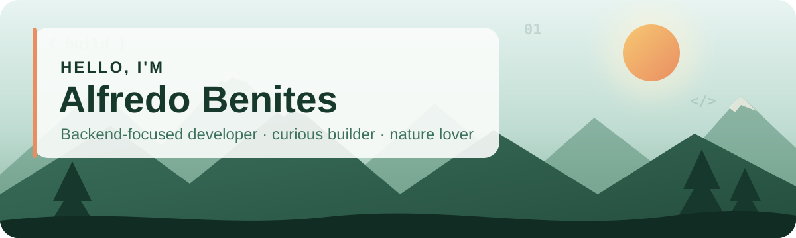

  

  
  
  

  <strong>I build reliable backend systems—and the full-stack products around them.</strong> 
  Backend engineering · API &amp; data design · product-minded building

 

<strong>🌿 A little about me</strong>

I'm a **first-generation college student** and backend-focused developer drawn to problems that affect real life—managing money, making daily decisions, and staying organized. My projects are full stack because I like bringing complete ideas to life, but the backend is where I'm most interested in growing: APIs, data models, authentication, business logic, and the systems that make a product dependable.

Coming from a low-income background taught me to be resourceful, persistent, and intentional with every opportunity. I carry that perspective into my work: understand the problem deeply, keep the experience human, and build something genuinely useful.

When I'm away from the keyboard, I enjoy slowing down in nature. It's where I reset, notice the details, and usually return with a clearer idea of what to build next.

<strong>✦ Selected work</strong>

<table>
  <tr>
    <td width="50%" valign="top">
      
<strong>💸 Finance Tracker</strong>

      
<strong>My flagship product</strong>

      
A multi-user personal-finance platform built to replace a fragile 1,000+ row spreadsheet. It brings card spending, cashback, reimbursements, budgets, investments, and net worth into one trustworthy system.

      
<strong>Engineering highlights</strong>

      <ul>
        <li>Strict multi-tenant isolation with Row-Level Security</li>
        <li>Integer-cent money calculations</li>
        <li>140 backend tests around critical logic</li>
      </ul>
      
<code>React</code> <code>FastAPI</code> <code>Supabase</code> <code>PostgreSQL</code>

      

        
        
      

    </td>
    <td width="50%" valign="top">
      
<strong>🎨 FitPalette</strong>

      
<strong>A local-first wardrobe planner</strong>

      
A mobile-first PWA that creates coordinated outfits from the clothes a user owns, what's clean, and what fits the occasion—with a deterministic recommendation engine instead of a black box.

      
<strong>Engineering highlights</strong>

      <ul>
        <li>Offline-first storage with optional cloud sync</li>
        <li>Deterministic outfit scoring and compatibility rules</li>
        <li>Accessible, responsive light and dark themes</li>
      </ul>
      
<code>React</code> <code>TypeScript</code> <code>IndexedDB</code> <code>Supabase</code>

      

    </td>
  </tr>
</table>

<strong>📝 Notes REST API</strong>

A clean Java backend for creating, reading, updating, and deleting notes. My first Spring Boot project helped me practice layered architecture, dependency injection, Maven, REST endpoint design, and JUnit 5 testing.

<strong>🎒 The tools in my backpack</strong>

  

- **Useful products** — Starting with a real frustration, then designing the smallest clear solution
- **Trustworthy foundations** — Secure data boundaries, predictable calculations, and tests around important behavior
- **Human interfaces** — Responsive layouts, accessible interactions, and details that make software feel considered
- **Growing deliberately** — Learning new tools through projects and practicing problem-solving consistently

<strong>🧭 Right now</strong>

- Building and refining **Finance Tracker** and **FitPalette**
- Deepening my backend skills through API design, databases, authentication, and testing
- Looking for opportunities to learn from a strong engineering team and contribute to products people depend on

  <em>Good software should feel a little like a well-marked trail: clear, dependable, and worth following.</em>

  

